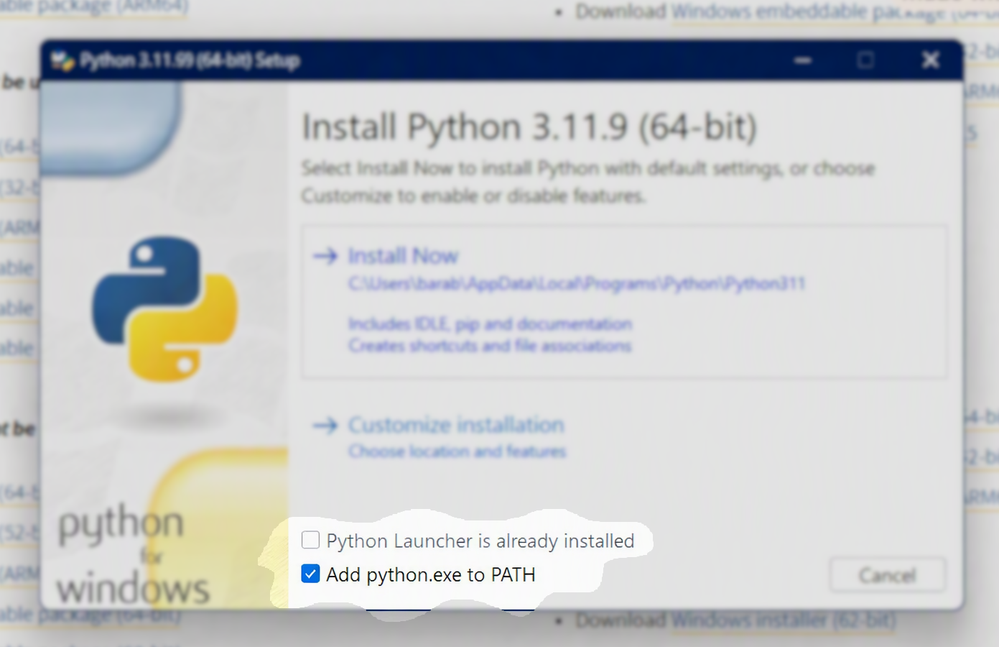
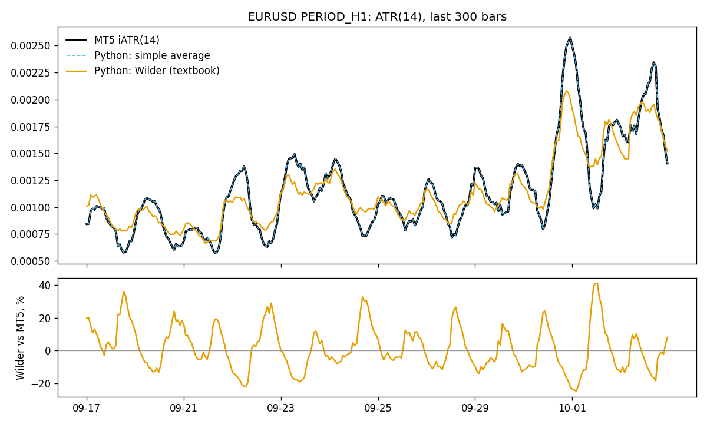

# Bridge: MT5 indicators in Python, exactly as an expert advisor sees them

*Part of [ProbLab](../README.md)*

> Research tool, not financial advice.

## The problem

You research an idea in Python, then code it as an MQL5 expert advisor —
and the tester disagrees with your notebook. One common reason: the
indicator. Python libraries compute indicators "by the textbook"; MetaTrader 5
computes them its own way. MT5's `iATR` is a **simple** average of True Range,
not Wilder's smoothing — on EURUSD H1 the typical gap is 9 % (see Result).

## The solution

Let the terminal do the maths. Python writes a JSON request into the
terminal's shared folder; the `BridgeEA` expert advisor creates the real
handles (`iRSI`, `iATR`, `iMACD`, … 38 indicators), copies the buffers and
answers with a CSV. What you get in Python is byte-for-byte what your expert
advisor gets in the tester.

```
Python                              MetaTrader 5 (BridgeEA, timer 1 s)
request_{id}.json  ───────────────► read, validate, iATR(...), CopyBuffer
                   ◄─────────────── response_{id}.csv, then delete request
```

## Before you start

No terminal skills needed beyond copying a few lines.

1. **Get the code with [GitHub Desktop](https://desktop.github.com/).**
   *File → Clone repository → URL* →
   `https://github.com/barabashkakvn/ProbLab` → choose a *Local path* → *Clone*.
   No GitHub Desktop? On the GitHub page press *Code → Download ZIP* and unzip.
2. **Choose the folder wisely.**
   - **Not** inside `C:\Program Files` — Windows does not let programs write there.
   - **Not** inside a folder synced by OneDrive (often *Documents* and
     *Desktop*) — the sync locks files while MetaTrader and Python write them.
   - Good: `C:\Users\<you>\ProbLab` or `D:\ProbLab`.
3. **Install [Python](https://www.python.org/downloads/) 3.10 or newer** and
   on the first installer screen tick **"Add python.exe to PATH"**. Without
   it Windows will not find `python` and `pip`.

   

4. **MetaTrader 5** from your broker — a demo account is enough.

**Opening PowerShell in the right folder.** In Explorer open the
`ProbLab\bridge` folder, right-click an empty space → *Open in Terminal*.
The prompt then already ends with `...\ProbLab\bridge>` and you can paste
the commands below.

## Five-minute start

```powershell
pip install -r requirements.txt
python install.py --check    # where it will install; if wrong, see "Paths"
python install.py            # copies BridgeEA + JAson.mqh, compiles
```

In MetaTrader 5: *Navigator → Expert Advisors → ProbLab → BridgeEA*, drag it
onto any chart. Then:

```powershell
python examples\quickstart.py
```

## Result

`examples\quickstart.py`, EURUSD H1, 6 059 bars (2025-10-13 … 2026-10-06),
ATR(14) computed in Python from the same bars that came through the bridge:

| ATR(14) in Python | max \|diff\| vs MT5 | median, % of ATR | max, % of ATR |
|---|---|---|---|
| simple average of True Range | 0.00000000 | 0.000 % | 0.00 % |
| Wilder's smoothing (textbook) | 0.00108604 | **8.9 %** | **59 %** |



The bridge is exact: a simple average of TR reproduces MT5 to the last digit.
The textbook ATR — the one most Python libraries give you — is off by 9 % on
a typical bar and by more than half on the worst one. A stop at "2 × ATR"
tested in Python is not the stop your expert advisor will place.

## Using it

```python
import sys
sys.path.insert(0, r"<bridge folder>\python")
import create_request as bridge

df = bridge.run_pipeline({
    "symbol": "EURUSD", "timeframe": "PERIOD_H1",
    "start_date": "2024.01.01", "end_date": "2024.03.01",
    "indicators": [
        {"name": "iRSI", "params": {"ma_period": 14, "applied_price": "PRICE_CLOSE"},
         "buffers": {"rsi14": 0}},
        {"name": "iATR", "params": {"ma_period": 14}, "buffers": {"atr14": 0}}]})
```

`df` columns: `datetime, open, high, low, close, rsi14, atr14` — bar open
time (broker server time), bid prices, buffers with 8 decimals, oldest first.

| Function | What it does |
|---|---|
| `run_pipeline(req, keep_csv=False, retries=3, timeout_sec=180)` | full cycle → `DataFrame` |
| `fetch_csv(req, retries=3, timeout_sec=180)` | → path of the response CSV (for your own cache) |
| `validate_request(req, load_etalon())` | list of errors, empty = fine |
| `lookahead_warnings(req)` | list of look-ahead warnings |

### Request rules

- `params` — **key order = argument order of the MQL5 call**, names exactly as
  in the table below; `symbol` and `period` are not passed.
- `buffers` — `{"column name": buffer index}`; Latin names, unique.
- `timeframe` — `PERIOD_M1 … PERIOD_MN1` (all 21). Dates `YYYY.MM.DD`
  [`HH:MM`], both ends inclusive.
- Enum values are strings: `PRICE_CLOSE…`, `MODE_SMA/EMA/SMMA/LWMA`,
  `STO_LOWHIGH/STO_CLOSECLOSE`, `VOLUME_TICK/VOLUME_REAL`.
- Always go through `create_request.py`: on an unknown string the EA
  **silently** falls back to `PRICE_CLOSE` / `MODE_SMA` / `PERIOD_H1`; the
  client catches that before sending.

### Indicators

| Indicator | Parameters (in exactly this order) | Buffers |
|---|---|---|
| `iAC` | — | main=0 |
| `iAD` | `applied_volume` (ENUM_APPLIED_VOLUME) | main=0 |
| `iADX` | `adx_period` (int) | main=0, plus=1, minus=2 |
| `iADXWilder` | `adx_period` (int) | main=0, plus=1, minus=2 |
| `iAlligator` | `jaw_period` (int), `jaw_shift` (int), `teeth_period` (int), `teeth_shift` (int), `lips_period` (int), `lips_shift` (int), `ma_method` (ENUM_MA_METHOD), `applied_price` (ENUM_APPLIED_PRICE) | jaw=0, teeth=1, lips=2 |
| `iAMA` | `ama_period` (int), `fast_ma_period` (int), `slow_ma_period` (int), `ama_shift` (int), `applied_price` (ENUM_APPLIED_PRICE) | main=0 |
| `iAO` | — | main=0 |
| `iATR` | `ma_period` (int) | main=0 |
| `iBands` | `bands_period` (int), `bands_shift` (int), `deviation` (double), `applied_price` (ENUM_APPLIED_PRICE) | base=0, upper=1, lower=2 |
| `iBearsPower` | `ma_period` (int) | main=0 |
| `iBullsPower` | `ma_period` (int) | main=0 |
| `iBWMFI` | `applied_volume` (ENUM_APPLIED_VOLUME) | main=0 |
| `iCCI` | `ma_period` (int), `applied_price` (ENUM_APPLIED_PRICE) | main=0 |
| `iChaikin` | `fast_ma_period` (int), `slow_ma_period` (int), `ma_method` (ENUM_MA_METHOD), `applied_volume` (ENUM_APPLIED_VOLUME) | main=0 |
| `iCustom` | `name` (string) | — **not implemented in the EA** |
| `iDEMA` | `ma_period` (int), `ma_shift` (int), `applied_price` (ENUM_APPLIED_PRICE) | main=0 |
| `iDeMarker` | `ma_period` (int) | main=0 |
| `iEnvelopes` | `ma_period` (int), `ma_shift` (int), `ma_method` (ENUM_MA_METHOD), `applied_price` (ENUM_APPLIED_PRICE), `deviation` (double) | upper=0, lower=1 |
| `iForce` | `ma_period` (int), `ma_method` (ENUM_MA_METHOD), `applied_volume` (ENUM_APPLIED_VOLUME) | main=0 |
| `iFractals` | — | upper=0, lower=1 |
| `iFrAMA` | `ma_period` (int), `ma_shift` (int), `applied_price` (ENUM_APPLIED_PRICE) | main=0 |
| `iGator` | `jaw_period` (int), `jaw_shift` (int), `teeth_period` (int), `teeth_shift` (int), `lips_period` (int), `lips_shift` (int), `ma_method` (ENUM_MA_METHOD), `applied_price` (ENUM_APPLIED_PRICE) | upper=0, lower=2 (1 and 3 are colour buffers) |
| `iIchimoku` | `tenkan_sen` (int), `kijun_sen` (int), `senkou_span_b` (int) | tenkan_sen=0, kijun_sen=1, senkou_span_a=2, senkou_span_b=3, chikou_span=4 |
| `iMA` | `ma_period` (int), `ma_shift` (int), `ma_method` (ENUM_MA_METHOD), `applied_price` (ENUM_APPLIED_PRICE) | main=0 |
| `iMACD` | `fast_ema_period` (int), `slow_ema_period` (int), `signal_period` (int), `applied_price` (ENUM_APPLIED_PRICE) | main=0, signal=1 |
| `iMFI` | `ma_period` (int), `applied_volume` (ENUM_APPLIED_VOLUME) | main=0 |
| `iMomentum` | `mom_period` (int), `applied_price` (ENUM_APPLIED_PRICE) | main=0 |
| `iOBV` | `applied_volume` (ENUM_APPLIED_VOLUME) | main=0 |
| `iOsMA` | `fast_ema_period` (int), `slow_ema_period` (int), `signal_period` (int), `applied_price` (ENUM_APPLIED_PRICE) | main=0 |
| `iRSI` | `ma_period` (int), `applied_price` (ENUM_APPLIED_PRICE) | main=0 |
| `iRVI` | `ma_period` (int) | main=0, signal=1 |
| `iSAR` | `step` (double), `maximum` (double) | main=0 |
| `iStdDev` | `ma_period` (int), `ma_shift` (int), `ma_method` (ENUM_MA_METHOD), `applied_price` (ENUM_APPLIED_PRICE) | main=0 |
| `iStochastic` | `Kperiod` (int), `Dperiod` (int), `slowing` (int), `ma_method` (ENUM_MA_METHOD), `price_field` (ENUM_STO_PRICE) | main=0, signal=1 |
| `iTEMA` | `ma_period` (int), `ma_shift` (int), `applied_price` (ENUM_APPLIED_PRICE) | main=0 |
| `iTriX` | `ma_period` (int), `applied_price` (ENUM_APPLIED_PRICE) | main=0 |
| `iVIDyA` | `cmo_period` (int), `ema_period` (int), `ma_shift` (int), `applied_price` (ENUM_APPLIED_PRICE) | main=0 |
| `iVolumes` | `applied_volume` (ENUM_APPLIED_VOLUME) | main=0 |
| `iWPR` | `calc_period` (int) | main=0 |

## Traps

1. **Look-ahead.** A buffer value on bar `t` is computed from `close[t]` —
   unknown when bar `t` opens. For a decision at the open of `t`, use row
   `t-1`. `iIchimoku` buffer 4 (`chikou_span`) holds `close[t + kijun]` — the
   future. `iFractals` (any buffer): a fractal on bar `t` checks bars `t+1`
   and `t+2`, so it is known only 2 bars later. A negative `*_shift` pulls
   future bars into `t`. The client prints
   `[warn]` for these.
2. **The first request for a new symbol often fails** — the terminal is still
   loading history. The client retries with a fresh request id.
3. **`EMPTY_VALUE`** (`1.797e+308`), not NaN, in fractals, SAR and at the start
   of a series.
4. **Broker bars** — broker time zone and gaps. They match the tester, not
   other data sources.

## Paths

Nothing is hard-coded: the bridge may live on `E:\`, the terminal in any
folder.

**Usually there is nothing to do.** Run `python install.py --check`: if it
shows the right terminal and folders, everything was found automatically.

**If your terminal is elsewhere** (not `C:\Program Files\MetaTrader 5`):

1. In the `bridge\` folder (next to `paths.example.json`) make a **copy** of
   that file named `paths.json`. Leave `paths.example.json` as it is — do not
   rename it.
   ```powershell
   copy paths.example.json paths.json
   ```
2. Open `paths.json` and put your path into `terminal`. Other keys can stay
   empty (`""`) — they are then found automatically.
3. Check: `python install.py --check`.

`paths.json` is your personal file; it is never committed to git.

| Key | Environment variable | Default |
|---|---|---|
| `terminal` | `BRIDGE_TERMINAL` | `C:\Program Files\MetaTrader 5\terminal64.exe` |
| `terminal_data` | `BRIDGE_TERMINAL_DATA` | found by `origin.txt` in `%APPDATA%\MetaQuotes\Terminal\*` |
| `common_files` | `BRIDGE_COMMON_FILES` | `%APPDATA%\MetaQuotes\Terminal\Common\Files` |

**Adding a new path? Only as a new key here — never as a string in code.**

## Limitations

- Windows only (terminal shared folder, ANSI request files).
- One request at a time; several Python processes simply queue.
- `iCustom` is in the reference table but not implemented in the EA.
- `BarsCalculated` is awaited for 10 s — very long M1 series with dozens of
  indicators may need a retry.
- Prices are bid; no spread, ask or volume (order volume as `iVolumes`).

## Files

| File | Role |
|---|---|
| `mql5/Experts/BridgeEA.mq5` | the expert advisor |
| `mql5/Include/JAson.mqh` | JSON for MQL5, third-party, MIT ([JAson](https://github.com/vivazzi/JAson), `JAson.LICENSE`) |
| `common_files/Bridge/indicators_etalon.json` | reference table: indicators, parameters, buffers — read by both sides |
| `python/create_request.py` | Python client |
| `python/bridge_paths.py` | path lookup |
| `install.py` | install + compile |
| `examples/quickstart.py` | five-minute check |

Code: MIT. JAson.mqh: MIT, © Alexey Sergeev, Artem Maltsev and contributors.
